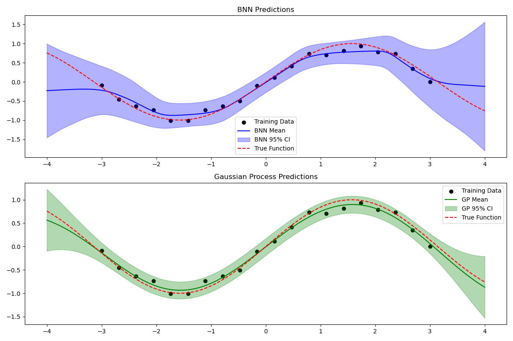

Looking at these two plots, we can see a comparison between Bayesian Neural Network (BNN) and Gaussian Process (GP) predictions for what appears to be a regression problem with a sinusoidal true function (shown as the red dashed line).

Let's analyze the key aspects of both approaches:

## For the BNN (top plot):

The blue line represents the mean prediction of the Bayesian Neural Network, while the light blue shaded area shows the 95% confidence interval. The network seems to capture the general sinusoidal pattern of the true function, but there are some notable characteristics. The confidence intervals are wider in regions with fewer training points, especially at the edges of the input space (around x = -4 and x = 4). This demonstrates the network's increased uncertainty when making predictions far from training data, which is a desirable property for real-world applications.

## For the Gaussian Process (bottom plot):

The solid black line shows the GP mean predictions, with the green shaded area representing its 95% confidence interval. The GP appears to provide a smoother fit to the data compared to the BNN. Its confidence intervals also expand in regions with sparse data, but in a more uniform and gradually increasing manner. This behavior is characteristic of GPs, which have built-in uncertainty estimation through their kernel functions.

## Comparing the two approaches:

1. Accuracy: Both methods appear to fit the true function well in regions with abundant training data (roughly between x = -3 and x = 3). The GP seems to provide slightly more accurate predictions, staying closer to the true function.

2. Uncertainty Quantification: The GP shows more consistent and gradually expanding uncertainty bounds compared to the BNN's somewhat more irregular confidence intervals. This difference stems from their fundamental approaches - GPs directly model the correlation between points through kernel functions, while BNNs learn uncertainty through parameter distributions.

3. Smoothness: The GP produces notably smoother predictions compared to the BNN. This is because GPs inherently enforce smoothness through their kernel function, while BNNs must learn smoothness from the training data.

What's particularly interesting is how both methods handle the edges of the input space (x < -3 and x > 3). The GP shows a more conservative uncertainty estimate, gradually returning to its prior mean, while the BNN's uncertainty bounds are wider and more erratic. This illustrates a key difference in how these models handle extrapolation beyond the training data.

These results suggest that for this particular problem, the GP might be the more reliable choice due to its smoother predictions and more consistent uncertainty estimates. However, it's worth noting that BNNs often have advantages in other scenarios, particularly with larger datasets or when the underlying function has discontinuities or sharp transitions.
